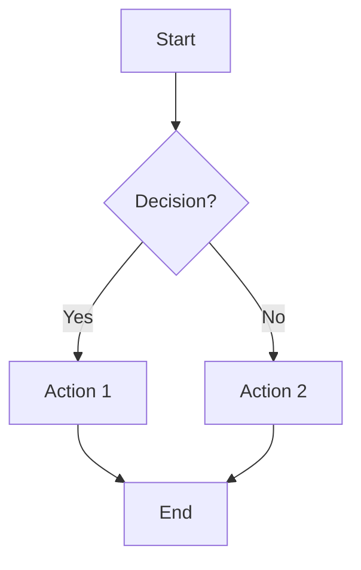
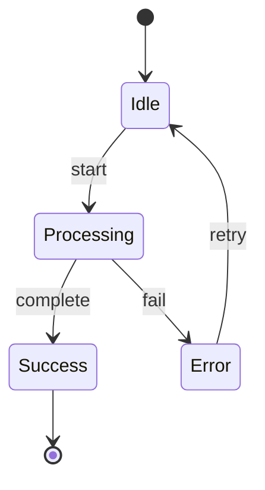
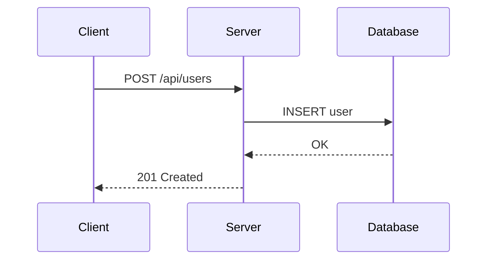
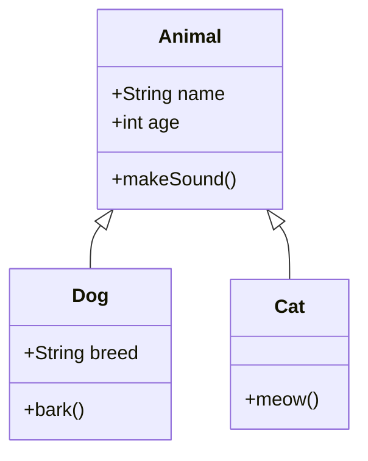
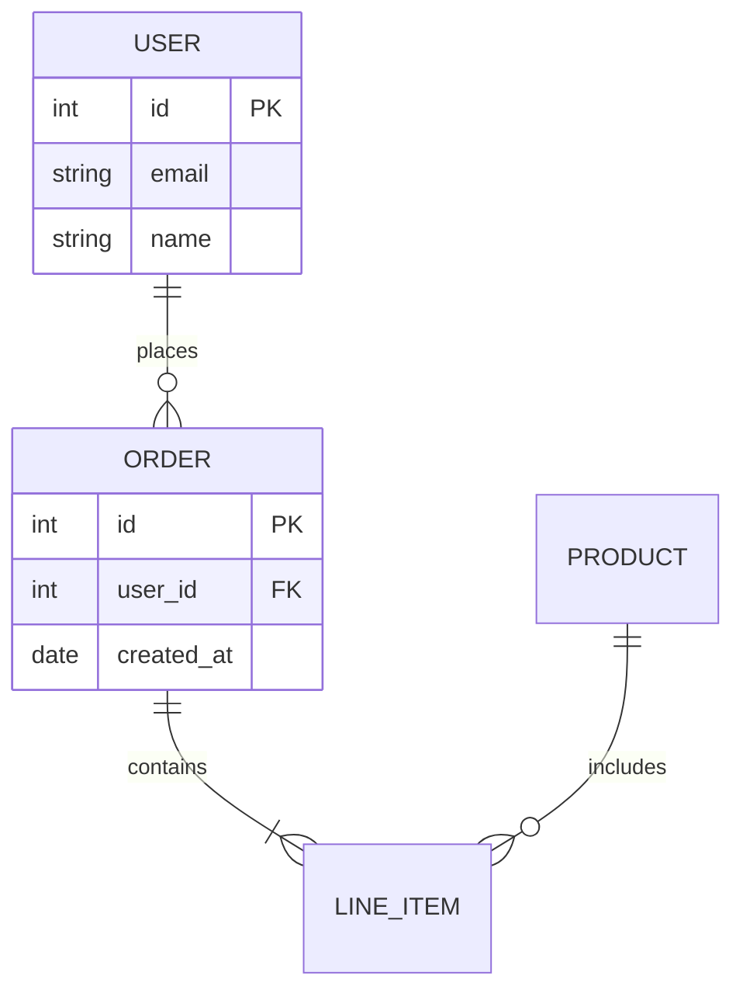
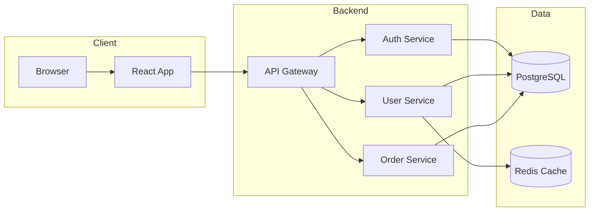

# Mermaid Diagrams

Render Mermaid diagrams as Unicode art directly in your response using [beautiful-mermaid](https://github.com/lukilabs/beautiful-mermaid).

**Default behavior:** Always render with `-f unicode` and display the output inline in your response.

## Setup

Run once before first use:

```bash
cd ~/.pi/agent/skills/mermaid-diagrams && bun install
```

## Usage

### Render a diagram file

```bash
cd ~/.pi/agent/skills/mermaid-diagrams
./render.js /path/to/diagram.mmd                      # → diagram.svg
./render.js /path/to/diagram.mmd -o output.svg        # Explicit output
./render.js /path/to/diagram.mmd -f unicode           # ASCII art (Unicode)
./render.js /path/to/diagram.mmd -f ascii             # Pure ASCII
./render.js /path/to/diagram.mmd -t dracula           # With theme
```

### Pipe diagram content directly

```bash
cd ~/.pi/agent/skills/mermaid-diagrams
echo "graph TD; A-->B-->C" | ./render.js - -f unicode
```

### List available themes

```bash
cd ~/.pi/agent/skills/mermaid-diagrams
./render.js --list-themes
```

**Themes:** zinc-light, zinc-dark, tokyo-night, tokyo-night-storm, tokyo-night-light, catppuccin-mocha, catppuccin-latte, nord, nord-light, dracula, github-light, github-dark, solarized-light, solarized-dark, one-dark

## When to Use Each Diagram Type

### Flowcharts (`graph` or `flowchart`)
Best for: **Decision trees, process flows, algorithms, user journeys**



Directions: `TD` (top-down), `LR` (left-right), `BT` (bottom-top), `RL` (right-left)

Node shapes:
- `[text]` — Rectangle
- `(text)` — Rounded
- `{text}` — Diamond (decision)
- `((text))` — Circle
- `[[text]]` — Subroutine
- `[(text)]` — Cylinder (database)
- `>text]` — Flag

### State Diagrams (`stateDiagram-v2`)
Best for: **Finite state machines, lifecycle states, status transitions**



### Sequence Diagrams (`sequenceDiagram`)
Best for: **API interactions, message flows, request/response patterns, protocol flows**



Arrow types:
- `->>` — Solid with arrowhead
- `-->>` — Dotted with arrowhead
- `-x` — Solid with X
- `--x` — Dotted with X

### Class Diagrams (`classDiagram`)
Best for: **Object-oriented design, data models, inheritance hierarchies**



Relationships:
- `<|--` — Inheritance
- `*--` — Composition
- `o--` — Aggregation
- `-->` — Association
- `..>` — Dependency

### ER Diagrams (`erDiagram`)
Best for: **Database schemas, entity relationships, data modeling**



Cardinality:
- `||` — Exactly one
- `o|` — Zero or one
- `}|` — One or more
- `}o` — Zero or more

## Workflow

**Always render diagrams and include them in your response text:**

1. Create the Mermaid diagram content
2. Pipe it to the render script with `-f unicode`
3. **Copy the output and paste it into a code block in your response**

```bash
cd ~/.pi/agent/skills/mermaid-diagrams
cat << 'EOF' | ./render.js - -f unicode
graph LR
    A --> B --> C
EOF
```

**Important:** Tool output appears in a collapsed block that the user may not see. You MUST copy the rendered diagram from the tool output and include it in your response as a fenced code block (use triple backticks with no language specifier).

**Optional:** If the user specifically asks for SVG, save to a file:
```bash
./render.js diagram.mmd -o output.svg
```

## Example: Architecture Diagram



## Tips

1. **Always paste diagram into response** — After rendering, copy the Unicode output from the tool result and paste it into a code block in your response text
2. **Keep diagrams focused** — One concept per diagram
3. **Use subgraphs** — Group related nodes in flowcharts
4. **Name participants** — Use aliases in sequence diagrams for clarity
5. **Choose direction wisely** — LR for timelines/flows, TD for hierarchies
6. **Only save SVG when asked** — Default to inline Unicode; only use `-o file.svg` if user requests a file
